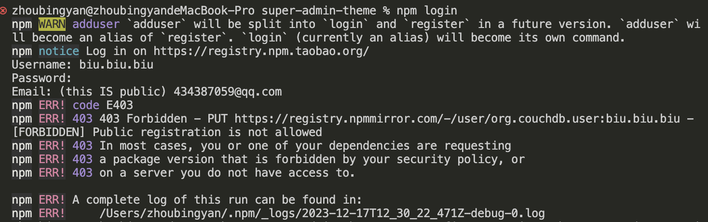
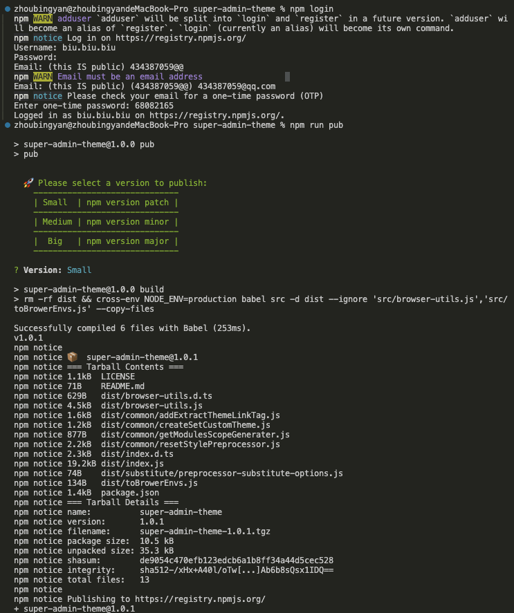
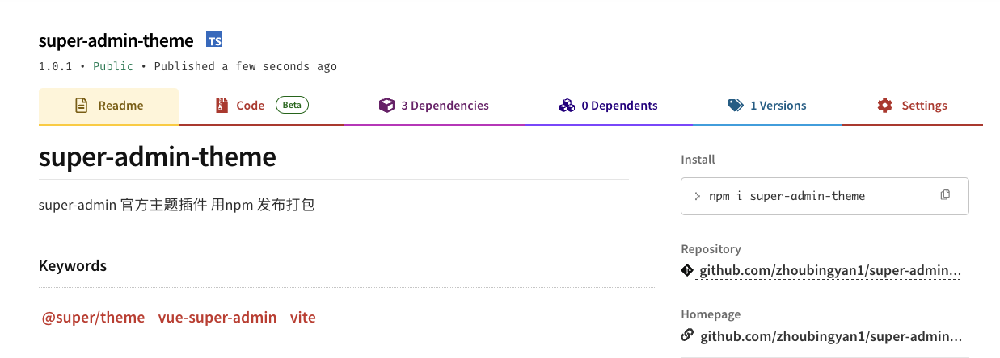

### 发布包
在代码终端输入npm login
输入npm账号 密码，以及邮箱

先注册登录npm login。登录不上，多数是因为日常开发中使用了淘宝的镜像，需要使用nrm切换到npm地址



```
npm config set registry https://registry.npmjs.org/
```




首次发布可以使用npm run pub，因为第一次版本不需要更新，就是1.0.0
后面可以使用npm run pub:patch等先更新了版本然后去发布。
当运行了npm run pub:patch以后，首先会更新package.json的version，然后发布，同时会自动commitpackage.json文件
发布成功以后即可在自己的npm仓库看到包名字。
